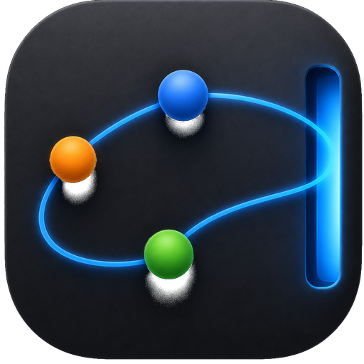
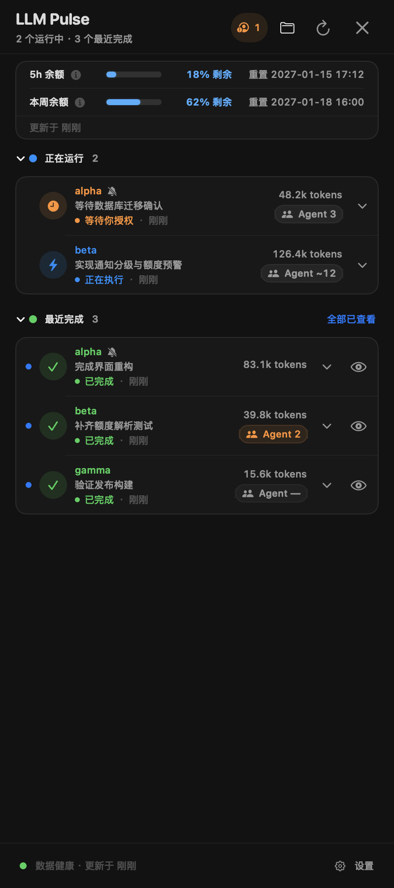

<p align="center">
  
</p>

# LLM Pulse — macOS 本地 AI 编程任务监控工具

<p align="center"><strong>让 AI 编程任务始终可见。</strong></p>

<p align="center">
  <a href="README.md">English</a> ·
  <a href="README.zh-CN.md">简体中文</a>
</p>

<p align="center">
  <a href="https://github.com/zuuzii-org/llm-pulse/releases/latest">下载</a> ·
  <a href="docs/ARCHITECTURE.md">架构</a> ·
  <a href="LICENSE">MIT License</a>
</p>

**LLM Pulse 是一款监控本机 AI 编程任务的开源原生 macOS 菜单栏应用。** 当前公开版本监控 Codex Desktop；v2.0 会把同一套右侧边栏工作流扩展到使用 Qwen3.7 的 Claude Code。LLM Pulse 集中显示运行中、等待操作、最近完成、活跃 Agent、token 和额度信息，同时不修改底层任务记录。

应用界面支持简体中文和英文。可在设置中选择“跟随系统 / 简体中文 / English”，切换后立即生效，无需重启。

<p align="center">
  
</p>

## 产品信息

| | |
|---|---|
| **产品** | LLM Pulse |
| **开发者** | Zuuzii |
| **平台** | macOS 14 或更高版本；支持 Apple Silicon 和 Intel |
| **类别** | 本机 AI 编程任务监控与菜单栏伴侣 |
| **当前任务范围** | 本机 Codex Desktop 创建的根任务 |
| **v2 目标** | 使用 Qwen3.7 的 Claude Code，按模型分页 |
| **数据方式** | 本地只读适配层；没有任务分析服务 |
| **网络访问** | 仅使用 GitHub Releases 进行可选更新检查与下载 |
| **许可证** | MIT |
| **隶属关系** | 独立项目，不是 OpenAI 产品 |

## 下载

[下载最新的已签名、已公证 DMG](https://github.com/zuuzii-org/llm-pulse/releases/latest)。当前最新公开版本仍是使用旧产品名发布的 **GPT Pulse v1.3.0**，要求 macOS 14 或更高版本，同时支持 Apple Silicon 和 Intel Mac。**LLM Pulse v2.0.0 是下一个计划版本，尚未发布。**

使用旧品牌命名的 v1.3.0 Release 附件包括：

- `GPT-Pulse-1.3.0.dmg`
- `GPT-Pulse-1.3.0.dmg.sha256`

将两个文件放在同一目录，然后执行以下命令校验下载内容：

```bash
shasum -a 256 -c GPT-Pulse-1.3.0.dmg.sha256
```

如果你正在使用 v1.0.0，需要手动安装一次 v1.1.0。v1.0.0 尚未包含应用内更新，无法发现新的更新通道。从 v1.1.0 开始，右键点击菜单栏项目并选择“检查更新…”即可在应用内更新。

## LLM Pulse 能显示什么

- **紧凑的菜单栏状态。** 上方数字代表活跃任务数，下方数字代表最近完成数。等待用户操作时，活跃数字变为橙色；出现失败任务时变为红色。
- **全高任务边栏。** 将鼠标停在当前屏幕右侧中间 60% 区域约 200ms，400px 宽的面板会从鼠标所在屏幕弹出，并避开相邻显示器之间的内部接缝。
- **可折叠任务分组。** “正在运行”和“最近完成”可以分别折叠；LLM Pulse 会在下次启动时恢复你的选择。
- **需要注意的状态。** 等待授权和等待回答的任务会优先呈现；失败和中断状态会在最近列表中明确标识。
- **有用的任务上下文。** 每项显示项目、session、持续时间、最后状态、累计 token，以及主 Agent 和全部层级子 Agent 的活跃总数。
- **直接定位任务。** 点击任务会通过 `codex://threads/<thread-id>` 打开对应 Codex Desktop 任务。从 LLM Pulse 打开完成任务后会自动标记为已查看，也支持手动和批量确认。
- **Codex 使用额度。** 侧边栏显示 5 小时和每周窗口的剩余百分比、重置时间与数据新鲜度。
- **原生通知。** 可选择“仅需我处理”“重要状态”或“全部”；支持任务操作、稍后 15 分钟或 1 小时提醒、安静的完成摘要和额度预警。
- **项目控制。** 可以只看某个 Git 项目，或将该项目通知静音一小时或到次日；菜单栏总数始终保持全局统计。
- **符合 macOS 使用习惯。** 支持开机启动、多显示器、减少动态效果、配置是否在全屏应用中启用触边，以及即时生效的中英文切换。

最近完成任务保留 24 小时，最多显示 20 条；未查看的成功任务优先进入保留集合。批量标记已查看后，可以在六秒内撤销。

## 工作原理

LLM Pulse 使用几层职责明确的本地适配器，不把任何一种 Codex 私有格式当作永久契约：

1. 可选插件写入最小化生命周期事件，让运行中和等待授权状态更及时。
2. Codex state SQLite 始终以 read-only 模式打开，并启用 SQLite `query_only`。
3. rollout JSONL 只解析任务状态、时间、Agent 生命周期、token 汇总和兼容的额度快照。
4. LLM Pulse 通过本机连接查询 Codex bundled App Server 的 `account/rateLimits/read`，获得与 Codex Desktop 同组的 5 小时和每周额度。
5. 已查看回执与 LLM Pulse 偏好继续保存在兼容路径 `~/Library/Application Support/GPT Pulse/`，确保改名后仍能继承已有状态。

只有 Codex Desktop 创建的根任务会成为独立任务行。子 Agent 不单列，而是聚合到根任务的活跃 `Agent N` 总数中。状态优先级、保留策略、额度选择与 adapter 降级行为见[架构说明](docs/ARCHITECTURE.md)。

## 隐私与网络访问

LLM Pulse 的设计边界是只读观察：

- 不写入 Codex 数据库、rollout、任务记录或 App Server state。
- 不提取、不保留、不上传 prompt、tool input、tool output 或 transcript 内容。
- 可选 hook journal 只保存 `session_id`、`turn_id`、事件名和时间戳，不记录项目路径。
- 已查看回执、通知设置和额度预警去重键仅保存在本机；项目静音保存 SHA-256 标识，不保存明文路径。
- 不需要 OpenAI API Key；应用不包含任务分析服务，也不会上传任务数据。

可选的更新检查只会读取 GitHub 上公开的 Release 信息，不会附带 Codex 任务数据，也不会生成或发送系统画像。日常任务监控始终在本机完成。

## 安装

1. 从 [GitHub Releases](https://github.com/zuuzii-org/llm-pulse/releases/latest) 下载 DMG 和对应的 SHA-256 文件。
2. 使用上面的命令验证校验和。
3. 打开当前 v1.3.0 DMG，将仍使用旧文件名的 `GPT Pulse.app` 拖入 `Applications`。
4. 从 `Applications` 启动应用。通知权限是可选的，不授权也能在本机监控任务。
5. 如果需要，可在 LLM Pulse 设置中开启开机启动。

## 应用内更新

旧品牌 GPT Pulse v1.1.0 开始支持应用内更新。右键点击菜单栏项目，选择“检查更新…”，即可检查公开的 GitHub Release feed 并安装新版本。

v1.1.0 是更新通道的 bootstrap 版本。v1.0.0 用户必须先手动下载并安装一次 v1.1.0；之后可跨产品与仓库改名原地更新。

## 可选 Codex 插件

不安装插件也能正常使用。此时，应用会使用只读 SQLite 和 rollout JSONL；安装仓库内的生命周期 hooks 后，运行中与等待授权状态会更及时。

```bash
codex plugin marketplace add zuuzii-org/llm-pulse --ref v1.3.0
codex plugin add gpt-pulse@gpt-pulse
```

Codex 提示时，请先检查并信任 hooks。插件将最小化事件写入：

```text
~/Library/Application Support/GPT Pulse/events/events.jsonl
```

hooks 只依赖 macOS 内置的 `/bin/sh` 和 JXA，不需要 Python、Node.js 或其他外部 runtime。

## 常见问题

### LLM Pulse 是什么？

LLM Pulse 是一款监控本机 Codex Desktop 任务的原生 macOS 菜单栏应用。它将任务状态和用量汇总到右侧边栏，让你不必一直打开每个任务窗口。

### 如何在 macOS 上同时监控多个 Codex Desktop 任务？

让 LLM Pulse 与 Codex Desktop 同时运行即可。菜单栏会汇总正在执行和最近完成的数量，右侧边栏则逐项显示每个本机根任务的状态、项目、持续时间、token 用量和活跃 Agent 总数。

### LLM Pulse 会修改或控制 Codex 任务吗？

不会。它读取 Codex 数据，并可以通过 deep link 打开已有任务，但不会批准、回答、停止、重试、创建、归档或编辑任务。

### LLM Pulse 会上传 prompt 或任务数据吗？

不会。任务监控留在本机。LLM Pulse 不会提取、保留或上传 prompt、tool input、tool output 或 transcript，也不需要 OpenAI API Key。

### 不安装 Codex 插件可以使用吗？

可以。插件完全可选。不安装时，LLM Pulse 使用只读 SQLite 和 rollout JSONL；部分运行中或等待授权的状态变化可能出现得稍晚。

### 会显示子 Agent 吗？

子 Agent 不会成为独立任务行。LLM Pulse 将主 Agent 与全部活跃后代聚合为根任务的 `Agent N`。如果本地证据不完整，会显示未知或可能过期，而不是把未知伪装成 `0`。

### 5 小时与每周数字代表什么？

它们是根据 Codex 提供的已用百分比换算出的剩余百分比，同时附带重置时间，并不是绝对 token 余额。LLM Pulse 只接受同一完整快照中的两个窗口，不会跨任务拼接数值。

### LLM Pulse 如何读取 Codex 使用额度？

它通过本机 Codex App Server 读取与 Codex Desktop 设置页一致的 5 小时和每周整组额度。兼容的本地 rollout 数据仅作为兜底，并且不会拼接来自不同快照的两个窗口。

### 能否从 LLM Pulse 直接打开 Codex Desktop 任务？

可以。点击任务行会通过本机 `codex://threads/<thread-id>` 链接打开对应任务。如果跳转失败，LLM Pulse 会保留未查看状态并显示错误，不会静默确认任务。

### 为什么已查看任务仍在“最近完成”中？

“已查看”只会清除未读状态，不会删除历史行。完成、失败和中断任务会在最近列表中保留最多 24 小时，同时受 20 条上限约束。

### v1.0.0 能自动更新吗？

不能。你需要先手动安装一次 v1.1.0，以加入应用内更新通道。从 v1.1.0 开始，可以使用菜单栏中的“检查更新…”。

### 支持 Codex CLI、IDE 任务、cloud task 或其他 AI 编程工具吗？

当前公开的 v1.3.0 版本仅支持本机 Codex Desktop 创建的根任务。Claude Code 与 Qwen3.7 支持计划在 LLM Pulse v2.0.0 中加入，详见 [v2 实施计划](docs/LLM_PULSE_V2_PLAN.md)；v2.0.0 尚未发布。

### LLM Pulse 是 OpenAI 官方产品吗？

不是。LLM Pulse 是 Zuuzii 独立开发的开源项目，与 OpenAI 无隶属关系，也未获得 OpenAI 的背书或维护。

## 已知限制

- Codex 本地 schema、rollout 事件和 deep link 都是私有兼容接口，未来可能变化。某个数据源不可用时，对应 adapter 会独立降级。
- `codex://threads/<thread-id>` 已在本版本测试所用的 Codex Desktop 构建中验证，但并非公开稳定契约。
- 无法稳定感知用户直接在 Codex Desktop 内打开任务。请从 LLM Pulse 打开，或手动确认，以清除未查看状态。
- Codex hooks 没有独立的“授权已批准”事件；相关工具产生 `PostToolUse` 前，任务可能短暂保持等待授权。
- 额度数据只提供百分比与重置时间，没有可可靠换算的绝对 token 配额。
- App 自身界面文案支持简体中文和英文；用户任务名、项目路径和 Codex 原始内容保持原样。

## 从源码构建

要求：macOS 14+、Xcode 16+ 和 [XcodeGen](https://github.com/yonaskolb/XcodeGen)。

```bash
git clone https://github.com/zuuzii-org/llm-pulse.git
cd llm-pulse
make check
open ".build/DerivedData/Build/Products/Debug/LLM Pulse.app"
```

`make check` 会生成 Xcode 工程，运行 Swift 与插件测试，并完成无需签名的 Debug 构建。使用 Xcode 开发时，执行 `make open`，然后选择 `GPTPulse` scheme。

## 许可与署名

LLM Pulse 使用 [MIT License](LICENSE) 开源，产品署名为 **Zuuzii**。

LLM Pulse 是独立项目，与 OpenAI 无隶属关系，也未获得 OpenAI 的背书或维护。文中产品和公司名称仅用于说明兼容范围。
