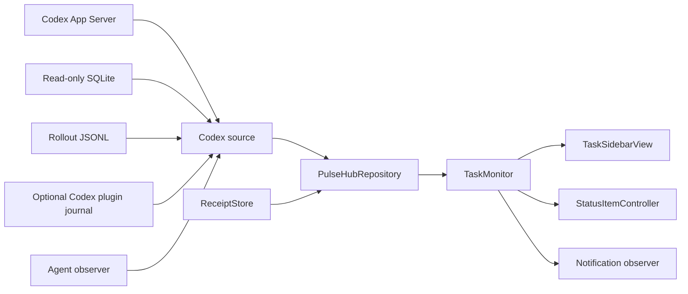

# LLM Pulse v2.0 Codex-only 架构与实施计划

> 状态：产品边界已更新，按 Codex-only 收口
>
> 决策日期：2026-07-13
>
> 发布基线：LLM Pulse v1.4.0
>
> 目标版本：LLM Pulse v2.0.0，计划 build `7` 或更高

## 1. 目标

LLM Pulse v2.0.0 将现有右侧任务边栏收口为稳定、可信、低打扰的本机 Codex Desktop 任务监控工具。

核心目标：

- 保持菜单栏和屏幕右侧边缘两个快速入口。
- 只展示本机 Codex Desktop 创建的根任务。
- 清晰区分运行中、等待授权、等待回答、完成、失败和中断。
- 展示根任务的活跃 Agent 总数、token 用量和 Codex weekly 剩余额度。
- weekly 重置时间使用 macOS 当前系统时区，显示准确日期和时间。
- 所有任务与用量数据在本机处理，不修改 Codex 任务记录。
- 完成 LLM Pulse 品牌、工程、Bundle ID、Application Support、插件和仓库身份迁移。
- 保留通用领域底座，但不把尚未接入的数据源宣传为当前能力。

## 2. 产品合同

### 2.1 当前支持范围

- 运行工具：Codex Desktop。
- 任务范围：本机根任务；子 Agent 聚合到根任务，不单独成行。
- 平台：macOS 14 或更高版本，Universal App 支持 `arm64` 与 `x86_64`。
- 语言：跟随系统、简体中文、English，切换后即时生效。
- 数据方式：本地、只读；不要求 OpenAI API Key。
- 用量界面：只显示 weekly 剩余百分比、重置时间和新鲜度。
- 用量通知：只为 weekly 窗口产生阈值提醒。

### 2.2 明确排除

- 不接入 Codex CLI、IDE 任务、cloud task 或其他 AI 编程工具。
- 当前界面不包含按模型分页的入口或相关手势。
- 不在当前 UI、菜单或通知中展示 5 小时额度。
- 不提供停止、重试、授权、回答、创建、归档或修改任务等写操作。
- 不读取或上传 prompt、tool input、tool output 或 transcript 正文。
- 不提供远程任务同步、任务分析服务或云端账户系统。
- 不允许旧品牌技术值散落在业务代码；升级兼容读取统一通过 `LegacyCompatibility`。

### 2.3 内部扩展边界

领域层保留 runtime、provider、profile、model snapshot 和 source-set 抽象，用于隔离物理数据源、保持测试稳定并控制未来演进成本。v2.0.0 的生产注册表只创建 Codex identity 与 Codex source；这些抽象不构成对其他运行工具的支持承诺。

## 3. 用户体验

### 3.1 菜单栏

- 固定图标区旁显示两行计数：活跃任务和最近任务。
- 运行圆点颜色优先级：失败红色、等待用户橙色、正常运行蓝色。
- 左键打开侧边栏；右键提供“打开下一条需处理任务”“检查更新…”和基础设置入口。
- 计数只来源于 Codex 任务，不显示模型或来源选择菜单。

### 3.2 右侧边栏

- 指针在当前显示器右侧中间 60% 连续停留约 200ms 后打开。
- 面板宽度 400px，全高显示在指针所在屏幕。
- 相邻显示器覆盖的内部接缝不触发。
- 全屏应用中默认禁用触边，可在设置中修改。
- 点击任务后，只有 Codex deep link 成功打开具体任务才自动标记已查看并收起侧栏。

### 3.3 信息层级

从上到下：

1. LLM Pulse 标题、最近更新时间和设置入口。
2. Codex weekly 用量卡。
3. 项目筛选和“全部已查看”。
4. 正在运行。
5. 等待授权。
6. 等待回答。
7. 最近任务，包括完成、失败和中断。

“正在运行”和“最近任务”可独立折叠；项目筛选、分组展开和任务详情展开状态保存在 LLM Pulse 自有偏好中。

### 3.4 任务行

每项显示：

- 任务标题。
- 项目名称与必要的 session 上下文。
- 持续时间或完成时间。
- 最后状态。
- 累计 token。
- 活跃 Agent 总数。
- 未查看状态和手动确认入口。

所有 loading、empty、degraded、error、disabled、hover、focus 和 active 状态都必须有明确呈现。动画控制在约 150–250ms，并遵守 Reduce Motion。

## 4. 总体架构



架构原则：

1. 物理格式由 adapter 隔离，UI 不直接读取文件或数据库。
2. 单次刷新形成完整快照后再原子发布，不拼接不同代次的字段。
3. adapter 超时或失败时明确降级，不清空仍可信的其他字段。
4. source 只读；回执与偏好只写入 LLM Pulse 自有目录。
5. 当前生产只注册 Codex source，Hub 的通用协议保持内部可扩展。

## 5. 领域模型

### 5.1 Identity

`ModelIdentity`、`ModelProfileID` 与 `ModelSourceID` 保留通用结构。当前有效生产 identity 只有 Codex：

```text
runtime: codex-desktop
provider: openai
profile: codex
source: codex
```

任何未知 identity 都不能由配置或历史偏好自动激活。选择器在当前快照只有 Codex 时固定落回 Codex，不在 UI 显示切换入口。

### 5.2 Task ID

Codex 任务 ID 保持 `thread_id + turn_id` 的稳定语义，以继续兼容已有回执。`ReceiptStore` 把任务 ID 视为不透明主键；v2.0.0 不为此增加数据库 schema migration。

### 5.3 Snapshot

内部继续使用 `ModelTaskSnapshot` 与 `PulseHubSnapshot`，但生产 Hub 只发布一个 Codex snapshot。菜单栏、侧边栏、通知和导航均由这一份快照派生，避免出现跨来源状态。

## 6. Codex 数据适配

### 6.1 数据源优先级

任务状态综合：

1. 已验证的 Codex plugin 生命周期事件。
2. rollout JSONL 生命周期。
3. read-only SQLite thread 元数据。

用量数据综合：

1. Codex bundled App Server 的 `account/rateLimits/read`。
2. 兼容 rollout 用量快照。

Token 数据综合：

1. rollout 最后一个非空 `total_token_usage`。
2. SQLite `threads.tokens_used` 只读降级值。

### 6.2 文件安全

- 只接受本地普通文件。
- 拒绝符号链接、多重 hard link、非当前用户 owner 和 group/world writable 文件。
- SQLite 使用 read-only、`query_only` 与 no-follow 约束。
- JSONL 从尾部有界读取；半行、损坏行和未知事件独立忽略。
- size/mtime 未变时复用缓存，避免高频重扫历史文件。
- 任何错误信息都不得包含 prompt、工具载荷或正文。

### 6.3 可选 Codex plugin

plugin 只记录：

- `session_id`
- `turn_id`
- `hook_event_name`
- `timestamp`

journal 写入 LLM Pulse 自有目录，使用 owner-only 权限与互斥边界。未安装、暂时不可读或未通过校验时，SQLite 与 rollout 基础监控继续工作。

## 7. 状态与 Agent

### 7.1 状态优先级

```text
waitingForApproval
waitingForAnswer
running
completed
failed
interrupted
```

- `PermissionRequest` 进入等待授权。
- 未匹配的 `request_user_input` call/output 进入等待回答。
- `UserPromptSubmit`、`task_started`、`PostToolUse` 证明运行活动。
- `task_complete` 证明完成。
- 没有后续恢复的错误进入失败。
- `turn_aborted` 进入中断并归入最近任务。
- SQLite `open` 行不能单独证明正在运行。

### 7.2 Agent 总数

- 非终态主 Agent 计 1。
- 递归统计所有仍有明确活跃生命周期的后代。
- 等待授权或回答仍计为活跃。
- 精确值显示 `Agent N`，待验证值显示 `~N`，无可信证据显示 `Agent —`。
- 终态任务为 `0` 时隐藏；终态根任务仍有活跃后代时保留异常提示。
- 子 Agent 不单列，也不提供控制操作。

## 8. Token 与 weekly 用量

### 8.1 Token

- `total_tokens = input_tokens + output_tokens`。
- `cached_input_tokens` 属于 input 子集。
- `reasoning_output_tokens` 属于 output 子集。
- 子集不重复相加。

### 8.2 Weekly 识别

- 从 App Server 响应顶层 `rateLimits` 选择 Codex pool；顶层缺失时只接受 `rateLimitsByLimitId["codex"]`。
- weekly 通过 `windowDurationMins == 10080` 识别，不依赖字段顺序。
- 剩余百分比为 `100 - used_percent`，范围钳制到 `0...100`。
- `resets_at` 按 macOS 当前系统时区格式化为准确日期和时间。
- 数据缺失、过期或存在冲突时显示“额度待刷新”，不猜测或拼接。

### 8.3 5 小时兼容边界

底层 parser 与兼容数据结构继续识别 `windowDurationMins == 300`，用于安全读取旧缓存、旧 rollout 和历史迁移数据。该窗口：

- 不进入当前 UI。
- 不进入菜单栏。
- 不产生通知或稍后提醒。
- 不替代 weekly。
- 不出现在当前用户功能宣传中。

### 8.4 Weekly 通知

- 只使用 weekly 自身的 `observedAt`、`resets_at` 和剩余百分比。
- 阈值按 20%、10%、5% 分级。
- 去重键包含 plan、`10080`、reset 时间与阈值。
- 同一 reset window 不重复发送相同阈值。
- 数据过期时不产生新的阈值通知；仍有效的 snooze 与当前 weekly window 对账。

## 9. 最近任务与回执

- 首次启动建立时间基线，不把历史完成任务批量标为未查看。
- 完成、失败和中断保留 24 小时，最多 20 条。
- 未查看的成功任务优先进入保留集合。
- deep link 成功打开具体任务后自动写入已查看回执。
- 跳转失败保留未查看状态并显示错误。
- 手动勾选写入回执；“全部已查看”使用单一事务。
- 批量确认可在六秒内撤销；撤销只删除该批 LLM Pulse 回执。
- 已查看不等于删除，任务仍保留到超出时间窗或数量上限。

## 10. 通知与项目控制

- 默认档位为“仅需我处理”。
- “重要状态”增加完成通知；“全部”再增加中断通知。
- 通知动作包括打开任务、打开 LLM Pulse、稍后提醒和标记已查看。
- 完成通知短暂聚合为安静摘要，避免通知风暴。
- 项目静音支持一小时或到次日，只过滤任务通知，不影响采集、右栏和菜单栏。
- 项目身份以 SHA-256 保存；旧版明文路径启动时迁移并删除。
- Notification Center 暂时投递失败时使用封顶退避重试；状态失效后停止。
- weekly 提醒遵守相同的通知权限、静音、新鲜度和去重边界。

## 11. 隐私与网络

- 不写入 Codex 数据库、rollout、任务记录或 App Server state。
- 不提取、缓存、日志化或上传 prompt、tool input、tool output 或 transcript 正文。
- 不读取 OpenAI API Key。
- 回执、偏好、通知去重和 plugin journal 只保存在 LLM Pulse 自有目录。
- 项目静音不保存明文路径。
- 正常监控不访问互联网。
- 可选更新检查只访问公开 GitHub Release feed，不附加任务数据，也不启用 Sparkle system profiling。

## 12. 品牌与升级

当前技术身份：

| 项目 | 当前值 |
| --- | --- |
| 产品名 | LLM Pulse |
| 版本 | 2.0.0 |
| App / executable | `LLM Pulse.app` / `LLM Pulse` |
| Xcode project / scheme / module | `LLMPulse` |
| Bundle ID | `com.zuuzii.LLMPulse` |
| Application Support | `~/Library/Application Support/LLM Pulse/` |
| Repository | `zuuzii-org/llm-pulse` |
| Codex plugin | `llm-pulse@llm-pulse` |

升级规则：

- v1.0.0 先手动安装 v1.1.0。
- v1.1–v1.3 先更新并启动 v1.4，再更新到 v2。
- v1.4 可直接进入 v2 更新路径。
- v2 使用新 macOS identity，通知可能需要重新授权；升级后检查“登录时启动”。
- 偏好、项目静音和已查看回执通过集中兼容层迁移。
- 重复 App、冲突数据根、符号链接、owner 或权限异常时 fail closed，不覆盖不确定数据。

## 13. 实施拆分

### Phase 0：产品边界

- [x] 明确 v2.0.0 当前只接入 Codex Desktop。
- [x] 明确通用领域底座只作为内部扩展点。
- [x] 明确当前 UI 和通知只使用 weekly。
- [x] 明确 5 小时只保留底层兼容。
- [x] 删除其他运行工具的 adapter、plugin、fixture 和 schema 资产。
- [x] 重写当前产品与架构文档。

### Phase 1：Codex 数据链路

- [x] App Server、SQLite、rollout 与 plugin journal 只读组合。
- [x] 任务状态与 Agent 递归观察。
- [x] 24 小时、20 条最近任务保留策略。
- [x] 回执、批量确认与六秒撤销。
- [x] Codex deep link 成功后确认已查看。
- [ ] 最终扫描生产注册表，证明只创建 Codex source。

### Phase 2：Weekly 收口

- [ ] UI 只渲染 weekly 用量。
- [ ] weekly reset 使用系统时区的准确日期和时间。
- [ ] 通知和 snooze 只使用 weekly。
- [ ] 5 小时 parser/兼容字段保留，但不进入任何用户可见路径。
- [ ] 增加 UI、通知、fallback 与迁移回归测试。

### Phase 3：交互与可访问性

- [x] 右侧中间 60%、约 200ms 触边。
- [x] 指针所在显示器弹出并避开内部接缝。
- [x] 分组折叠、项目筛选与任务详情展开。
- [x] 中英文即时切换。
- [x] Reduce Motion 与键盘焦点基础支持。
- [ ] 多显示器、全屏、触边、自动收起和 VoiceOver 真机回归。

### Phase 4：品牌与发布

- [x] 用户可见品牌统一为 LLM Pulse。
- [x] 源码、工程、scheme、module 和 Bundle ID 统一为当前身份。
- [x] Codex plugin、仓库、clone、Release 与 appcast 地址统一。
- [x] 版本保持 2.0.0。
- [ ] 生成并验收 v2 DMG 与 Codex-only 产品截图。
- [ ] 完成 v1.4.0 → v2.0.0 Sparkle 升级演练。
- [ ] Developer ID 签名、公证、staple 与 Gatekeeper。
- [ ] Sparkle EdDSA、appcast 和远端下载回验。
- [ ] GitHub v2.0.0 Release。

## 14. 测试矩阵

### 14.1 Codex parser 与 adapter

- 正常、空、半行、损坏 JSON 和未知事件。
- 超大 JSONL、追加、truncate 与 rotation。
- 符号链接、hard link、弱权限、非 owner 和异常路径。
- SQLite `open` 不误判为 running。
- plugin journal 缺失、损坏和延迟。
- App Server 超时、错误、旧结果和恢复。
- token 子集不重复计数。

### 14.2 Weekly

- 只识别 `10080` 为用户可见 weekly。
- primary / secondary 顺序互换不影响选择。
- top-level 缺失时精确选择 Codex pool。
- 冲突 reset tuple 返回待刷新。
- reset 时间按系统时区格式化。
- weekly 20%、10%、5% 通知去重。
- 5 小时数据仍可解析，但 UI、菜单、通知和 snooze 均不可见。

### 14.3 任务与回执

- 运行、等待授权、等待回答、完成、失败和中断。
- Agent 主从递归、结束、恢复、未知和过期。
- 首次启动基线。
- 24 小时与 20 条上限。
- 未查看成功任务优先保留。
- deep link 成功与失败。
- 单项确认、批量确认与撤销。
- 项目聚焦、静音与明文路径迁移。

### 14.4 macOS 与本地化

- 菜单栏点击、右键和自动收起。
- 右侧触边、多显示器内部接缝、全屏开关。
- loading、empty、degraded、error 和 disabled。
- 键盘导航、VoiceOver、Reduce Motion。
- 中英文结构与含义一致。
- 系统时区切换后 reset 文案刷新。

### 14.5 升级与发布

- v1.1–v1.3 → v1.4 → v2。
- v1.4 → v2。
- 偏好、回执和项目静音迁移。
- 通知重新授权与登录项状态。
- Universal Release build。
- Developer ID、公证、staple、Gatekeeper。
- DMG 拖拽安装、Sparkle、appcast 和 GitHub Release 回验。

## 15. 风险与降级

| 风险 | 处理方式 |
| --- | --- |
| Codex 私有 schema 变化 | adapter 隔离、未知字段忽略、明确 degraded/unavailable |
| SQLite `open` 被误当运行 | 必须有 rollout 或 plugin 生命周期证据 |
| App Server 暂时不可用 | 保留仍有效的最近 weekly；否则显示待刷新 |
| 5 小时字段意外回到 UI | 独立 presentation/notification 测试与残留扫描 |
| weekly 与其他 pool 混淆 | 精确 Codex pool、`10080` 和 reset tuple 校验 |
| Agent 证据不完整 | `~N`、过期或 `Agent —`，不伪造零 |
| deep link 变化 | 打开失败不写回执，明确提示用户 |
| 双 App 或双数据根 | 启动时 fail closed，不覆盖或静默合并 |
| 更新链路中断 | 保留 build 6 bridge 并完成两条真实升级路径 |

## 16. Definition of Done

LLM Pulse v2.0.0 只有同时满足以下条件才算完成：

- 当前生产运行时只注册 Codex Desktop。
- 任务状态、Agent、token、通知、未查看和打开行为通过完整回归。
- UI、菜单栏、通知和公开文案只展示 weekly，不展示 5 小时。
- 5 小时旧数据仍能由底层兼容层安全解析，不影响 weekly。
- weekly 剩余百分比与系统时区重置时间准确。
- 通用领域底座保留，但没有用户可见的未接入入口或宣传。
- 所有用户可见品牌为 LLM Pulse，版本为 2.0.0。
- GitHub 仓库、Release、clone 与 appcast 地址统一为 `zuuzii-org/llm-pulse`。
- v1.4.0 用户能安全升级，偏好和回执保持，通知与登录项行为符合发布说明。
- Swift、Codex plugin、release、brand 和结构测试全部通过。
- Developer ID、签名、公证、staple、DMG、Sparkle、appcast 和远端附件回验通过。

## 17. 维护规则

- 仓库和测试是实现事实来源；文档不得提前宣传未通过发布门禁的能力。
- 新数据源必须先经过明确产品决策、隐私审查、真实 fixture、故障降级和完整发布测试。
- 任何公开用量文案必须说明指标来源、时间窗和重置语义。
- 任何不确定状态都必须显式降级，不能用看似精确的值掩盖证据不足。
