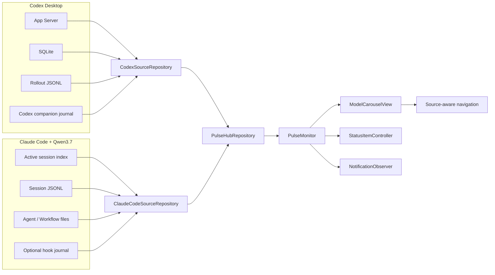

# LLM Pulse v2.0 架构与实施计划

> 状态：产品边界已确认，允许进入实现
>
> 决策日期：2026-07-12
>
> 当前发布基线：GPT Pulse v1.3.0（旧品牌），commit `b922624`
>
> 目标版本：LLM Pulse v2.0.0（尚未发布），计划 build `6`

## 1. 目标

LLM Pulse v2.0 将当前只面向 Codex Desktop 的右侧任务栏升级为本机多 AI 编程任务观察台，同时保持以下核心原则：

- 继续提供低打扰的菜单栏和右侧边缘入口。
- 按“运行工具 + 模型身份”组织数据，不把 Claude Code 与 Qwen 写死成同一个概念。
- 第一批运行工具为 Codex Desktop 与 Claude Code。
- Claude Code 第一批模型范围为 Qwen3.7 系列，重点验收本机当前使用的 `qwen3.7-max`，并兼容 `qwen3.7-plus`。
- 所有任务、状态、token、Agent 和项目数据只在本机处理。
- LLM Pulse 不修改 Codex 或 Claude Code 的任务、会话、transcript 和授权结果。
- 任何不确定状态都必须显式降级，不能用看似精确的值掩盖证据不足。

## 2. 已确认产品合同

### 2.1 已确认

- 用户可见品牌由 **GPT Pulse** 改为 **LLM Pulse**。
- 右栏采用独立模型页，默认顺序为 `Codex → Qwen3.7 Max`。
- 双指左右滑切换模型页，同时保留鼠标点击、键盘和 VoiceOver 入口。
- 菜单栏运行/完成数量聚合所有已启用模型；右栏任务和用量只展示当前模型页。
- 当前模型页会被记住；通知或“下一条需处理任务”会自动切换到任务所属模型页。
- Qwen 页面展示本机可验证的模型、session、token、错误和 Agent 数据。
- Qwen 页面不伪造百炼套餐剩余比例、5 小时额度或固定重置时间。
- Claude Code 基础监控零配置、只读可用；精确授权/回答状态通过可选 companion plugin 增强。
- 运行中的 Claude Code 任务优先激活原宿主终端；已退出会话通过 `claude --resume <session-id>` 恢复。
- v2.0.0 继续沿用现有 Bundle ID、UserDefaults、通知身份、Sparkle key 和数据目录；GitHub 仓库改名为 `zuuzii-org/llm-pulse`，并验证旧地址重定向及既有更新通道连续性。

### 2.2 暂定默认值

- 模型页不循环切换；在边界页提供轻微视觉阻尼。
- 切页动画为 200ms 左右；Reduce Motion 下直接切换。
- Codex 与 Qwen 各自保存项目筛选和 section 展开状态。
- Qwen 页面标题使用 `Claude Code · Qwen3.7 Max`，副标题显示检测到的百炼计划类型。
- 每个根 session 的实际主模型对应一个独立 profile；当前只有 `qwen3.7-max`，所以首版默认显示两页。以后检测到 `qwen3.7-plus` 时新增独立页面，不与 Max 混排。
- Qwen session 没有可靠自定义标题时，使用项目名和时间，不读取第一条 prompt 生成标题。
- Qwen3.7 根 session 产生的 Qwen3.6 Flash 等辅助 Agent 仍计入该根任务的 Agent 总数，但不会单独成为模型页。
- companion plugin 是增强项，不是使用 LLM Pulse 的前置条件。

### 2.3 实施中必须补齐的现场证据

- 用本机 Qwen3.7 Max 实际触发一次普通工具调用、权限请求、`AskUserQuestion`、前台 Agent 和后台 Agent。
- 验证百炼响应下 `message.model`、`message.usage`、错误和 stop reason 字段是否持续完整。
- 验证 Claude Code companion hooks 在当前 `2.1.205` 版本下的事件顺序和重复投递行为。
- 从已安装 GPT Pulse v1.3.0 执行一次真实 Sparkle 更新到 LLM Pulse 改名构建。
- 验证改名后开机启动、通知权限、UserDefaults 和已查看回执仍保留。

### 2.4 明确排除

- v2.0 不接入 Claude.ai Pro/Max 官方额度。
- v2.0 不接入其他 Claude 模型、DeepSeek、GLM 或任意第三方网关。
- v2.0 不读取百炼 API Key，也不使用套餐 Key 主动查询或调用百炼服务。
- v2.0 不提供停止、重试、授权、回答、切换模型或修改会话等控制能力。
- v2.0 不接入远程或云端 Claude Code 会话。
- v2.0 不使用 Claude Code `statusLine`，避免覆盖用户已有配置。
- v2.0 不要求启用 OTel；OTel 只作为后续本机统计增强候选。
- v2.0 不更换 Bundle ID，不重命名 Swift module、Xcode target 或 notary profile；GitHub 仓库改名属于本次品牌迁移范围。

## 3. 已核验运行环境

本机当前环境只读取了非敏感字段，没有读取或输出任何凭据值：

| 项目 | 当前值 |
| --- | --- |
| Claude Code | `2.1.205` |
| 百炼端点类型 | Token Plan |
| 主模型 | `qwen3.7-max` |
| 子 Agent 模型 | `qwen3.7-max` |
| 快速模型 | `qwen3.6-flash` |
| 活跃会话索引 | `~/.claude/sessions/<pid>.json` |
| 会话 transcript | `~/.claude/projects/<project>/<session-id>.jsonl` |
| Agent 数据 | `<session-id>/subagents/agent-*.jsonl` |
| Workflow 数据 | `<session-id>/workflows/*.json` |
| Claude task 数据 | `~/.claude/tasks/<session-id>/*.json` |

百炼 Coding Plan 与当前 Token Plan 不应混淆。Coding Plan 当前支持 `qwen3.7-plus`；本机使用的是 Token Plan 下的 `qwen3.7-max`。适配器必须根据非敏感 host 和 transcript 中的真实模型 ID 区分计划类型，不能只看默认模型设置。

## 4. 总体架构



### 4.1 分层原则

1. **Runtime** 表示运行工具，例如 Codex Desktop、Claude Code。
2. **Provider** 表示模型提供方，例如 OpenAI、阿里云百炼。
3. **Model profile** 表示可切换的数据页，例如 Codex、Claude Code + Qwen3.7 Max。
4. **Source repository** 只负责一个 profile 的任务、用量和健康状态。
5. **Hub repository** 并发刷新全部 profile，并在单一来源失败时保留其他来源。
6. UI、通知和导航只依赖统一领域模型，不直接读取 Codex 或 Claude Code 文件。

`ModelProfileID` 由 runtime、provider、plan kind 与规范化 model ID 构成，例如 `claude-code:aliyun-token-plan:qwen3.7-max`。它不包含 endpoint 全路径、账户信息、Key 或其他敏感值。

## 5. 领域模型

计划新增以下核心类型；最终命名可按现有 Swift 风格微调，但职责不得合并：

```swift
enum AIRuntimeID: String, Codable, Sendable {
    case codexDesktop
    case claudeCode
}

enum AIProviderID: String, Codable, Sendable {
    case openAI
    case aliyunBailian
}

struct ModelProfileID: RawRepresentable, Hashable, Codable, Sendable {
    let rawValue: String
}

struct ModelIdentity: Equatable, Codable, Sendable {
    let profileID: ModelProfileID
    let runtime: AIRuntimeID
    let provider: AIProviderID
    let modelID: String
    let displayName: String
    let planKind: ModelPlanKind?
}

struct ModelTaskSnapshot: Equatable, Sendable {
    let identity: ModelIdentity
    let tasks: [PulseTask]
    let usage: ModelUsageSnapshot?
    let rateLimits: RateLimitSnapshot?
    let health: [AdapterHealth]
    let refreshedAt: Date
}

struct PulseHubSnapshot: Equatable, Sendable {
    let models: [ModelTaskSnapshot]
    let refreshedAt: Date
}
```

### 5.1 `PulseTask` 兼容迁移

`PulseTask` 新增：

- `profileID`
- `runtime`
- `provider`
- `modelID`
- 通用 `sessionID`
- `navigationTarget`

兼容规则：

- 现有 Codex `id = threadId:turnId` 保持不变，确保已有未查看回执继续生效。
- Claude Code 使用 `claude-code:<session-id>:<turn-id>`。
- `threadId` 在 Codex 路径继续保留；新代码优先使用 `sessionID`。
- 通知 route 必须包含 `profileID`，避免不同来源 UUID 冲突。
- ReceiptStore 继续把 `task_id` 当不透明主键，不为 v2.0 增加数据库 schema migration。

### 5.2 用量模型

Codex 继续使用现有：

- `TokenUsageSnapshot`
- `RateLimitSnapshot`

Qwen 新增 `ModelUsageSnapshot`，分别保存：

- `inputTokens`
- `outputTokens`
- `cacheCreationInputTokens`
- `cacheReadInputTokens`
- `observedRequestCount`
- `observedAt`

Qwen cache 字段不套用 Codex 的包含关系，不生成未经证明的“可计费总量”。UI 逐项展示原始计数字段，并明确它们是本机已观察数据。

## 6. Repository 与刷新策略

### 6.1 协议

```swift
protocol ModelTaskRepositoryProtocol: Sendable {
    var profileID: ModelProfileID { get }
    func snapshot(now: Date) async -> ModelTaskSnapshot
}

protocol PulseHubRepositoryProtocol: Sendable {
    func snapshot(now: Date) async -> PulseHubSnapshot
    func markViewed(_ tasks: [PulseTask], at date: Date) async throws
    func unmarkViewed(_ tasks: [PulseTask]) async throws
}
```

### 6.2 Codex 迁移方式

- 先用 `CodexSourceRepository` 包装当前 `TaskRepository`，不改现有 Codex 状态归并算法。
- `CodexAccountRateLimitObserver`、`CodexAgentActivityObserver` 和现有 fallback 顺序保持不变。
- 在统一层测试通过前，不同时重构 Codex adapter 内部实现。

### 6.3 Hub 刷新

- `PulseHubRepository` 使用 task group 并发读取每个 profile。
- 单一来源失败时返回该来源的 degraded/unavailable snapshot，不清空其他来源。
- `PulseMonitor` 继续以约 750ms 刷新 UI；各 adapter 内部自行缓存重扫描成本较高的数据。
- Claude Code active session index 可高频读取；大 JSONL 只读取尾部并按 size/mtime 缓存。
- snapshot 发布继续使用 generation token，旧刷新结果不能覆盖新结果。

## 7. Claude Code + Qwen3.7 适配器

### 7.1 文件结构

建议新增：

```text
GPTPulse/Data/ClaudeCodePaths.swift
GPTPulse/Data/ClaudeCodeConfigurationDetector.swift
GPTPulse/Data/ClaudeCodeActiveSessionReader.swift
GPTPulse/Data/ClaudeCodeJSONLTailParser.swift
GPTPulse/Data/ClaudeCodeSessionAdapter.swift
GPTPulse/Data/ClaudeCodeAgentActivityObserver.swift
GPTPulse/Data/ClaudeCodeHookJournalReader.swift
GPTPulse/Data/ClaudeCodeSourceRepository.swift
GPTPulse/Domain/ModelIdentity.swift
GPTPulse/Domain/ModelUsageSnapshot.swift
GPTPulse/Domain/PulseHubSnapshot.swift
GPTPulse/Services/ClaudeCodeNavigator.swift
ClaudePlugin/.claude-plugin/plugin.json
ClaudePlugin/hooks/hooks.json
ClaudePlugin/hooks/record_event.js
```

### 7.2 模型识别

模型页是否收录某个 session，必须以 transcript 中实际出现的 assistant `message.model` 为主要证据。

首版 allowlist：

- `qwen3.7-max`
- `qwen3.7-plus`
- 官方同系列 snapshot ID；必须经过显式 parser 验证，不能仅用宽泛的 `hasPrefix("qwen")`。

一个根 session 如果在运行期间切换主模型，以最后一个有完整 assistant metadata 的根模型作为当前 profile；模型身份变化必须生成明确的迁移事件，不能让同一 task 同时出现在两个页面。子 Agent 的辅助模型不改变根 session 所属 profile。

`settings.json` 中的 `.model`、`ANTHROPIC_MODEL` 与 `ANTHROPIC_BASE_URL` 只用于 profile 预检测和 plan 分类，不能单独证明某个历史 session 使用了 Qwen3.7。

严禁读取、缓存、日志化或写入：

- `ANTHROPIC_AUTH_TOKEN`
- `ANTHROPIC_API_KEY`
- 任何 `sk-*` 值
- 完整 prompt、tool input、tool output、assistant 正文

### 7.3 活跃 session

`~/.claude/sessions/<pid>.json` 提供：

- `pid`
- `sessionId`
- `cwd`
- `startedAt`
- `procStart`
- `version`
- `entrypoint`
- `kind`

读取后必须：

1. 验证文件是当前用户拥有的普通文件。
2. 拒绝符号链接和异常大文件。
3. 验证 PID 仍存在。
4. 比较进程启动时间与 `procStart`，防止 PID 复用。
5. session 文件只证明进程存活，不直接证明正在生成内容。

### 7.4 transcript 读取

只解析以下结构字段：

- `type`
- `sessionId`
- `cwd`
- `timestamp`
- `uuid`
- `parentUuid`
- `message.model`
- `message.stop_reason`
- `message.usage`
- tool block 的 `name`、`id` 和闭合关系
- `system.subtype`、`level`、retry 状态

读取策略：

- 首次读取文件尾部 128KB。
- 证据不足时最多扩大到 1MB。
- 文件 size/mtime 未变时复用缓存。
- 忽略半行、损坏行和未知事件，不因单行失败清空整个 session。
- 不把 transcript 文本保存进 snapshot 或错误信息。

### 7.5 状态可信度

| 证据 | 状态 | 可信度 | 说明 |
| --- | --- | --- | --- |
| `UserPromptSubmit` hook | `running` | 高 | 新一轮开始 |
| `PreToolUse` / `PostToolUse` | `running` | 高 | 工具执行中或继续生成 |
| `PermissionRequest` / `permission_prompt` | `waitingForApproval` | 高 | 仅 companion hook 可精确识别 |
| 未闭合 `AskUserQuestion` / `Elicitation` | `waitingForAnswer` | 高 | 必须有明确工具或 hook 证据 |
| 普通未闭合 `tool_use` | `running` | 中 | 不猜测为等待授权 |
| `Stop` / `end_turn` | `completed` | 中高 | 即使进程仍常驻，本轮也已完成 |
| `StopFailure` | `failed` | 高 | companion hook 明确信号 |
| `system.subtype = api_error` 且无后续恢复 | `failed` | 高 | retry 成功后应恢复 |
| 异常 `SessionEnd` | `interrupted` 或 `failed` | 中高 | 按 reason 分类 |
| 只有进程存活 | 未知或最近可信状态 | 低 | 不能直接标为 running |

基础只读模式不能准确区分“工具正在执行”和“工具等待授权”。没有 companion hook 时必须保持 `running` 或显示近似标记，不能伪装成精确的 `waitingForApproval`。

### 7.6 Agent 观察值

只统计当前根 session 关联的 Agent：

- 主 Agent 在非终态时计 1。
- `subagents/agent-*.jsonl` 中仍活跃的 Agent 计入总数。
- Workflow 的 `workflowProgress[].state` 与 `agentCount` 用于交叉验证。
- `~/.claude/tasks/<session-id>/` 只在 session 当前活跃时使用，避免历史残留造成误计。
- Qwen3.6 Flash 等辅助模型若属于 Qwen3.7 根 session，计入 Agent 总数但不创建独立模型页。
- 证据不完整时沿用现有 `Agent N`、`~N`、`Agent —` 语义。

### 7.7 标题与项目

标题来源顺序：

1. Claude Code 明确的 `customTitle` 或公开 session name。
2. Workflow name。
3. 项目目录名加开始时间。

禁止读取首条用户 prompt 生成标题。

### 7.8 companion plugin

companion plugin 只记录最小字段：

- `session_id`
- `hook_event_name`
- `timestamp`
- `cwd`
- `tool_name`
- `tool_use_id`
- `agent_id`
- `agent_type`
- 非敏感 reason/status

事件范围：

- `UserPromptSubmit`
- `PermissionRequest`
- `Notification`
- `PreToolUse`
- `PostToolUse`
- `PostToolUseFailure`
- `Stop`
- `StopFailure`
- `SessionEnd`
- `SubagentStart`
- `SubagentStop`
- `Elicitation`

插件要求：

- 作为独立 Claude Code plugin 安装，不覆盖用户现有 hooks。
- 写入 LLM Pulse 自有 journal，不修改 Claude Code transcript。
- journal 只允许当前用户读写，拒绝符号链接。
- 文件有明确上限、互斥写入与保留策略。
- 无插件时 app 仍可工作，只降低部分状态精度。

## 8. 导航行为

新增来源感知协议：

```swift
protocol TaskNavigating {
    @MainActor
    func open(_ task: PulseTask) -> TaskOpenResult
}
```

### 8.1 Codex

- 保持 `codex://threads/<thread-id>`。
- 成功打开后按当前语义标记完成任务已查看。

### 8.2 Claude Code

- session 对应进程仍活跃时，尝试激活原宿主终端。
- 无法可靠匹配窗口时，打开项目目录并显示恢复操作，不并发 resume 同一活跃 session。
- session 已退出时，以参数化方式调用 `claude --resume <session-id>`。
- 禁止拼接未经验证的 shell 字符串；session ID、cwd 和 executable path 分别校验。
- 打开成功后才标记已查看；失败则保留未查看并显示错误。

终端支持顺序暂定：

1. 当前可识别的原宿主终端。
2. 用户在设置中选择的终端。
3. macOS Terminal。

## 9. 模型分页 UI

### 9.1 页面结构

```text
┌────────────────────────────────────┐
│ LLM Pulse          [Codex][Qwen3.7] │
│ 当前模型状态摘要             ×     │
├────────────────────────────────────┤
│ Codex: 5h / weekly quota            │
│ Qwen: model / plan / local tokens   │
├────────────────────────────────────┤
│ 等待操作                            │
│ 正在运行                            │
│ 失败                                │
│ 最近完成                            │
├────────────────────────────────────┤
│ ● ○    当前模型健康状态    设置     │
└────────────────────────────────────┘
```

### 9.2 每页独立状态

按 `ModelProfileID` 保存：

- 项目筛选
- section 展开状态
- task token 明细展开状态
- 键盘焦点
- 当前滚动位置（若实现成本和稳定性允许）

全局保存：

- 当前模型页
- 应用语言
- 通知策略
- 边缘触发设置

### 9.3 Codex 用量卡

现有 5 小时和每周额度逻辑保持不变，仍优先读取 App Server 同组 `rate_limits`。

### 9.4 Qwen 用量卡

显示：

- `Qwen3.7 Max`
- `阿里云百炼 · Token Plan`
- 当前 session 或当前页本机已观察的 token
- input/output/cache 分项
- 最近更新时间
- “在百炼控制台查看额度”入口

不显示：

- 伪造的剩余百分比
- 固定 5 小时重置时刻
- 未经授权查询的套餐 Credits

## 10. 双指横滑状态机

### 10.1 实现位置

在 AppKit 事件层处理 precise scroll event，候选位置：

- `PulsePanel.scrollWheel(with:)`；或
- 包装 `NSHostingView` 的专用 `ModelSwipeHostingView`。

不在整个 SwiftUI 页面直接使用 `DragGesture`，避免吞掉垂直 `ScrollView`、按钮和菜单事件。

### 10.2 状态

```swift
enum HorizontalModelSwipePhase {
    case idle
    case detecting(accumulatedX: CGFloat, accumulatedY: CGFloat)
    case locked(direction: SwipeDirection, accumulatedX: CGFloat)
    case committed(gestureID: UInt64)
}
```

### 10.3 判定规则

- 只处理 `hasPreciseScrollingDeltas == true`。
- 8–12pt 后才锁定轴向。
- `abs(x) >= abs(y) * 1.3` 才进入横滑。
- 累计横向位移达到 60–72pt 后切一页。
- 每个 gesture ID 最多触发一次。
- Momentum event 只能完成当前切换，不能启动下一次切换。
- 竖向或未锁定事件继续传给 `super`。
- Magic Mouse 与 `Shift + 滚轮` 不作为首版主要交互，不能误触发。
- 自然滚动方向必须以 MacBook Trackpad 真机测试确定最终映射。

### 10.4 动画与无障碍

- 默认使用 180–220ms ease-out 横向过渡。
- Reduce Motion 开启时只更新内容和页码，不做位移动画。
- 模型切换器具备 tab 语义、选中状态和明确 VoiceOver label。
- 支持 `Control + Left/Right` 或等价键盘命令切页。
- 点击目标最小 32pt，焦点环清晰可见。

## 11. 菜单栏与通知

### 11.1 菜单栏

- `● active` 聚合全部 profile 的 running/waiting。
- `✓ recent` 聚合全部 profile 的最近完成。
- 颜色优先级继续为：失败红 > 等待用户橙 > 正常蓝。
- 右键菜单增加每个 profile 的简要计数，但顶部紧凑显示不增加额外行。
- “打开下一条需处理任务”跨 profile 排序，并在打开失败时切换到对应模型页。

### 11.2 通知

- 通知 subtitle 显示来源，例如 `Codex` 或 `Claude Code · Qwen3.7 Max`。
- route 加入 `profileID` 和通用 `sessionID`。
- 项目静音继续按规范化工作目录生效，可跨 profile 复用同一项目身份。
- 完成摘要允许合并同一 profile 的任务；不同 profile 默认分开，避免来源不清。
- Qwen adapter 暂时降级时保留上一可信状态，不能在恢复后重复发送完成通知。

## 12. 品牌迁移

### 12.1 用户可见项改为 LLM Pulse

- `CFBundleDisplayName`
- App 菜单、侧栏、设置、通知、辅助功能文本
- 中英文本地化资源
- DMG 卷名、背景、拖拽文案
- App filename（仅在升级演练通过后）
- README、截图、社交图、Release Notes
- GitHub title、description、topics 与插件展示名
- App Server client title

### 12.2 v2.0 保留的技术身份

| 项目 | v2.0 决策 | 原因 |
| --- | --- | --- |
| Bundle ID | 保留 `com.zuuzii.GPTPulse` | 保留更新、偏好和通知身份 |
| Swift module | 保留 `GPTPulse` | 避免无价值大规模重命名 |
| Xcode target/scheme | 保留 | 降低发布风险 |
| Application Support | 保留 `GPT Pulse` 路径 | 保留 receipts 与旧插件 journal |
| Sparkle public key | 保留 | 维持更新信任链 |
| Sparkle private-key 文件 | 保留旧文件名 `GPT Pulse Sparkle Ed25519.key` | 避免丢失现有签名身份或误生成新 key |
| Notary profile | 保留 `GPTPulseNotary` | 仅为本机凭据 lookup 名 |
| GitHub repo | 改为 `zuuzii-org/llm-pulse` | 与用户可见品牌一致，并保留旧 URL 重定向验证 |
| Codex plugin ID | 保留 `gpt-pulse` | 避免重复安装与事件分叉 |

### 12.3 统一品牌常量

新增 `PulseBrand`，集中管理：

- 用户显示名 `LLM Pulse`
- legacy display name
- product/repository URL
- support URL
- technical storage root
- bundle identifier 的只读声明

业务代码不再散落硬编码的 `GPT Pulse` 或 `LLM Pulse`。

### 12.4 Sparkle 改名演练

发布前必须完成：

1. 安装公开 v1.3.0。
2. 使用测试 feed 更新到 LLM Pulse v2.0.0 候选构建。
3. 验证旧 App 被正确替换，不出现两个菜单栏进程。
4. 验证 `/Applications` 中最终文件名和 bundle ID。
5. 验证开机启动状态。
6. 验证通知权限、语言、折叠状态、项目静音和 receipts。
7. 验证 Sparkle 后续更新仍可发现同 bundle。

如果完整 `.app` 改名无法稳定原地升级，v2.0 先使用 `CFBundleDisplayName = LLM Pulse`，保持外层 bundle filename，待单独迁移版本解决。

## 13. 实施拆分

### Phase 0：保护基线与建立 fixtures

- [ ] 保护当前未提交的 Xcode 本地改动，避免被 `xcodegen generate` 覆盖。
- [ ] 记录 v1.3.0 回归基线和关键 snapshot。
- [ ] 从本机 CC 数据生成严格脱敏的小型 fixture。
- [ ] fixture 不包含 prompt、response、tool input、tool output、用户名、绝对路径和凭据。
- [ ] 增加 Qwen 真实场景采样清单。

### Phase 1：多来源领域层

- [ ] 新增 runtime/provider/profile/domain 类型。
- [ ] 给 `PulseTask` 增加来源与导航身份，同时保持 Codex ID。
- [ ] 新增 `ModelTaskSnapshot`、`PulseHubSnapshot`。
- [ ] 用 `CodexSourceRepository` 包装现有 repository。
- [ ] 新增 hub repository 与 monitor。
- [ ] 更新 receipt、notification route 和选择器测试。
- [ ] 证明 Codex 页面与 v1.3.0 行为等价。

### Phase 2：Claude Code 基础只读适配

- [ ] 实现路径发现与非敏感配置检测。
- [ ] 实现 active session reader 和 PID 复用防护。
- [ ] 实现 bounded JSONL tail parser。
- [ ] 实现 Qwen3.7 family matcher。
- [ ] 实现 session 元数据、状态、错误和 token 汇总。
- [ ] 实现 Agent/Workflow 观察器。
- [ ] 实现 Claude Code source repository 与 health。
- [ ] 没有插件时验证完整降级 UI。

### Phase 3：Claude Code companion plugin

- [ ] 建立 `.claude-plugin/plugin.json` 和 hooks manifest。
- [ ] 实现最小化、并发安全、owner-only journal。
- [ ] 覆盖 permission、answer、stop、failure、subagent 生命周期。
- [ ] 提供安装、状态检查、升级和卸载说明。
- [ ] app 不自动修改用户 Claude Code settings。
- [ ] journal 不存在或损坏时基础适配器继续工作。

### Phase 4：导航、菜单栏与通知

- [ ] 抽象 source-aware navigator。
- [ ] Codex deep link 行为回归。
- [ ] 活跃 CC session 的终端定位。
- [ ] 已退出 CC session 的安全 resume。
- [ ] 通知 route 加来源并迁移旧 payload fallback。
- [ ] 菜单栏聚合计数和 profile 明细。
- [ ] 跨 profile “下一条需处理任务”。

### Phase 5：模型分页与双指手势

- [ ] 建立 `ModelCarouselView` 和模型切换器。
- [ ] 各页独立 loading/empty/error/degraded 状态。
- [ ] 各页独立筛选、展开和焦点状态。
- [ ] 实现 `HorizontalModelSwipeState` 纯状态机。
- [ ] 在 AppKit 层接入 precise scroll events。
- [ ] 加入 click、keyboard、VoiceOver 入口。
- [ ] 加入 Reduce Motion 路径。
- [ ] MacBook Trackpad 与 Magic Mouse 真机测试。

### Phase 6：LLM Pulse 品牌迁移

- [ ] 引入 `PulseBrand` 并替换用户可见字符串。
- [ ] 完成中英文文案。
- [ ] 更新 App display name、DMG、截图和文档。
- [ ] 更新 Codex/Claude companion 的展示名。
- [ ] 更新 release script 对 LLM Pulse artifact 的支持。
- [ ] 将 GitHub repository 改名为 `llm-pulse`，更新 clone、Release、appcast 与项目链接并验证旧 URL 重定向。
- [ ] 完成 v1.3.0 → v2.0.0 Sparkle 升级演练。
- [ ] 根据演练结果决定外层 `.app` 是否同步改名。

### Phase 7：发布门禁

- [ ] Swift 单元测试、插件测试和完整 Debug/Release build。
- [ ] Universal `arm64 + x86_64` 验证。
- [ ] 本机真实 Codex + Qwen 并行任务测试。
- [ ] 全状态通知、未查看、项目静音和任务打开测试。
- [ ] 多显示器、全屏、触边、滑动和自动收起回归。
- [ ] Developer ID 签名、公证、staple、Gatekeeper。
- [ ] DMG 拖拽安装与旧版更新验证。
- [ ] Sparkle EdDSA、appcast、远端下载回验。
- [ ] GitHub v2.0.0 Release 和 README/SEO 更新。

## 14. 测试矩阵

### 14.1 Claude Code parser

- 正常 session、空 session、半行、损坏 JSON、未知事件。
- 超大 JSONL、追加读取、truncate、rotation。
- 符号链接、弱权限、非 owner 文件、异常路径。
- 同一项目多 session、同一 session 多模型、模型切换。
- `end_turn` 后进程仍存活。
- 普通未闭合 tool use 与 `AskUserQuestion` 的区别。
- API error 后 retry 成功和最终失败。
- subagent/workflow/task 历史残留。

### 14.2 多来源聚合

- Codex 与 Claude session ID 相同也不冲突。
- 单一来源 unavailable 不清空另一来源。
- Codex receipt 旧 ID 保持已查看。
- Claude receipt 使用命名空间 ID。
- 全局菜单计数与当前页计数分别正确。
- 通知点击后切换正确模型页。

### 14.3 手势

- 纯竖滑透传。
- 纯横滑切一页。
- 斜滑阈值前不误判。
- Momentum 不连续翻页。
- 第一页/最后一页不越界。
- 自然滚动开启/关闭。
- Trackpad、Magic Mouse、普通鼠标滚轮。
- 列表顶部/底部、按钮、菜单、展开行附近。
- Reduce Motion 与 VoiceOver。

### 14.4 品牌与升级

- 所有用户界面只显示 LLM Pulse。
- Bundle ID、UserDefaults domain 和 receipts 保持。
- v1.3.0 原地更新后没有重复 App 或进程。
- 登录项、通知权限、语言、项目静音保持。
- 旧 Codex plugin journal 仍可读取。
- 新 Claude companion journal 不影响 Codex journal。

## 15. 风险与降级

| 风险 | 处理方式 |
| --- | --- |
| Claude Code 私有 JSONL schema 变化 | adapter 独立、未知字段忽略、health 降级、保留上一可信状态 |
| 常驻 CC 进程被误判为运行 | 进程只证明 session 存活；以 transcript/hooks 判断 turn 状态 |
| 无 hooks 时无法精确判断授权 | 保持 running/近似，不显示虚假 waiting approval |
| Qwen token 字段语义与 Codex 不同 | 独立 usage 类型，cache 分项展示，不混算 |
| 百炼没有公开剩余额度 API | 只显示本机观察值和控制台入口 |
| active session 无法定位原终端 | 降级为打开项目和恢复入口，不并发 resume |
| 双指横滑吞掉竖向列表滚动 | AppKit 轴锁定状态机、阈值和 momentum 去重 |
| App filename 改名破坏 Sparkle | 先做 v1.3.0 升级演练，失败则只改 display name |
| xcodegen 覆盖本地工程偏好 | 实施前保护现有两项 Xcode 本地改动，完成后恢复 |

## 16. Definition of Done

LLM Pulse v2.0 只有同时满足以下条件才算完成：

- Codex 现有任务状态、额度、Agent、通知、未查看和打开行为无回归。
- 本机 `qwen3.7-max` 能显示真实 session、项目、状态、token 和 Agent。
- 无 companion plugin 时有完整可理解的降级状态。
- 有 companion plugin 时能准确显示授权、回答、完成、失败和 subagent 生命周期。
- 双指横滑与垂直滚动无明显冲突，且有完整无障碍替代入口。
- 菜单栏聚合与模型页数据一致。
- 所有用户可见品牌为 LLM Pulse。
- GitHub 仓库、Release、clone 与 appcast 的当前地址统一为 `zuuzii-org/llm-pulse`，旧地址重定向通过验证。
- v1.3.0 用户能安全升级，设置、通知、回执和登录项保持。
- 完整测试、签名、公证、DMG、Sparkle 和 GitHub Release 远端回验通过。

## 17. 官方能力参考

- [阿里云百炼：在 Claude Code 中使用千问](https://help.aliyun.com/zh/model-studio/claude-code)
- [阿里云百炼：模型列表](https://help.aliyun.com/zh/model-studio/text-generation-model)
- [阿里云百炼：Token Plan](https://help.aliyun.com/zh/model-studio/token-plan-overview)
- [Claude Code Sessions](https://code.claude.com/docs/en/sessions)
- [Claude Code Hooks](https://code.claude.com/docs/en/hooks)
- [Claude Code Plugins Reference](https://code.claude.com/docs/en/plugins-reference)
- [Claude Code Monitoring Usage](https://code.claude.com/docs/en/monitoring-usage)
